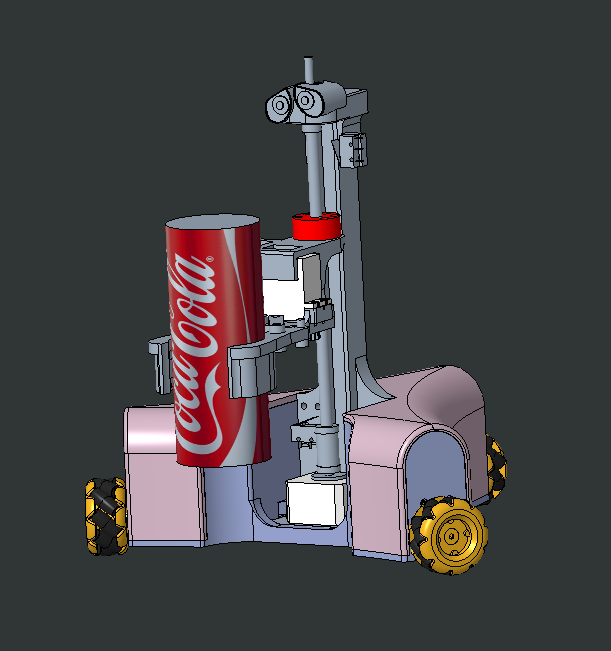
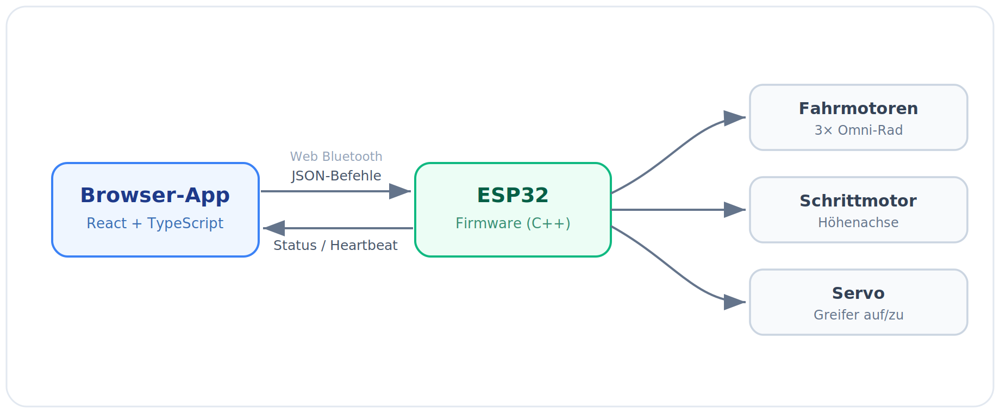
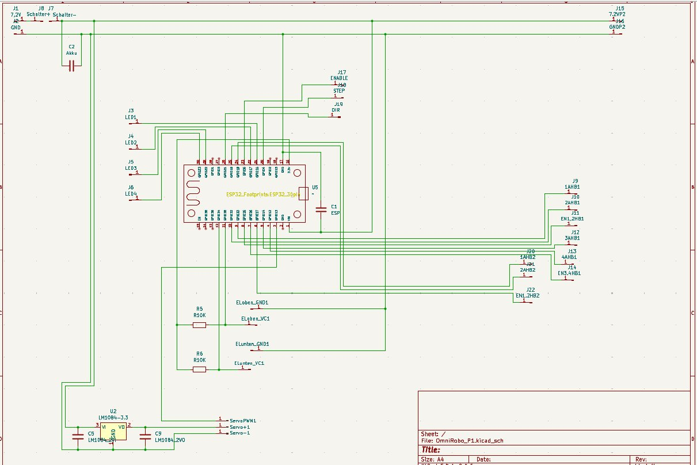
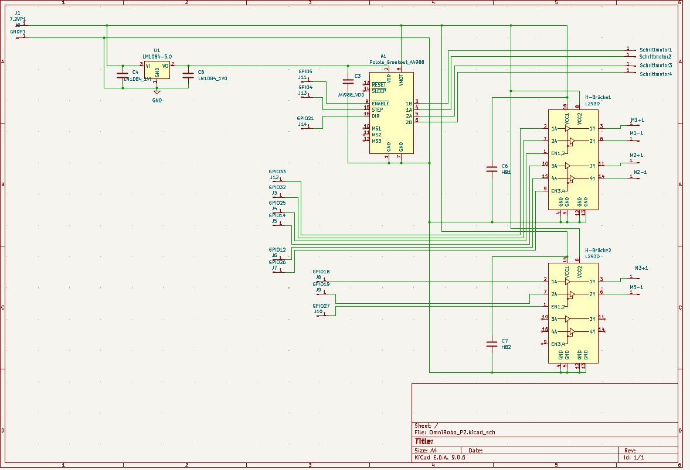
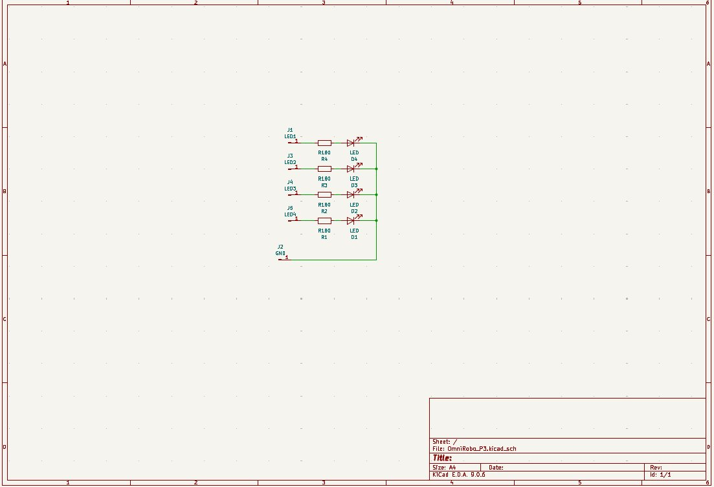
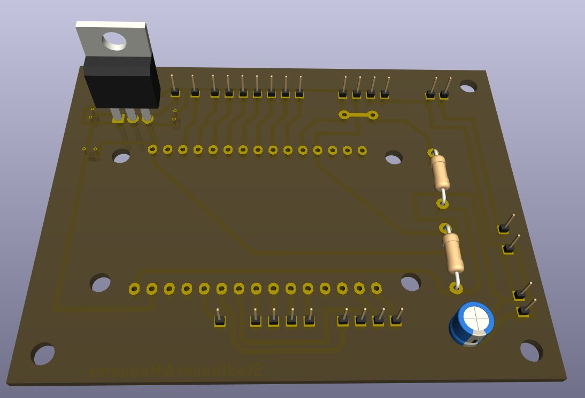
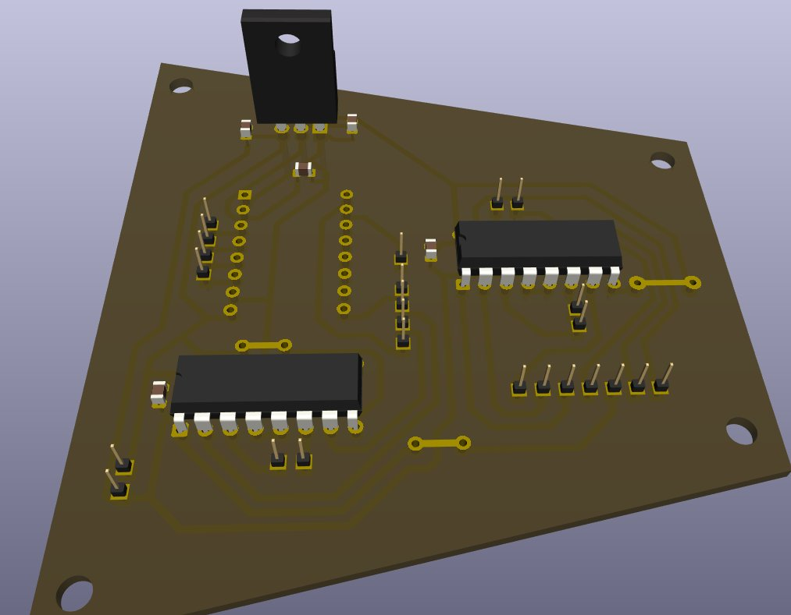
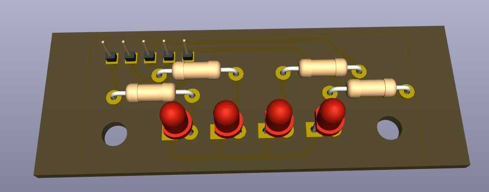

# 🤖 Omni-Robo

### Ein omnidirektionaler Roboter mit Greifarm – gesteuert direkt aus dem Browser über Bluetooth.

  

 

---

## Über das Projekt

Omni-Robo ist ein ferngesteuerter Roboter, den wir in unserem KOP-Projekt im 4. Jahrgang an der HTL Steyr gebaut haben. Er fährt omnidirektional über drei Räder, kann sich also in jede Richtung bewegen und gleichzeitig drehen. Oben drauf sitzt ein Greifarm an einer Spindel, mit dem er Sachen aufheben, hochfahren und woanders wieder absetzen kann.

Gesteuert wird er über eine Website, die sich per Bluetooth direkt mit dem Roboter verbindet. Man muss also nichts installieren – Seite öffnen, verbinden, losfahren.

In diesem Repo liegt nur die Software, also die Steuerungs-Website und die Firmware für den ESP32. Die Mechanik haben wir in Creo konstruiert und großteils 3D-gedruckt, die Platinen in KiCad gezeichnet. Diese Dateien sind hier nicht dabei, aber weiter unten sind ein paar Bilder davon.

---

---

## Was er kann

Fahren funktioniert über zwei Joysticks – einer für die Bewegung, einer fürs Drehen. Der Greifer wird über einen eigenen Joystick gesteuert: zur Seite öffnet und schließt er (Servo), nach oben und unten fährt der Greifarm (Schrittmotor). Die ganze Verbindung läuft über Bluetooth direkt aus dem Browser.

Der Roboter meldet während der Fahrt laufend seinen Status zurück. Wenn die Verbindung abbricht, bleibt er von selbst stehen, damit er nicht unkontrolliert weiterfährt. Zum Testen gibt es außerdem einen Debug-Modus, in dem man jeden Motor einzeln ansteuern kann.

---

## Wie die Steuerung funktioniert

Die Website verbindet sich per Web Bluetooth direkt mit dem ESP32. Sobald man einen Joystick bewegt, schickt sie einen kleinen JSON-Befehl an den Roboter. Damit die Funkverbindung nicht überlastet wird, wird immer nur der aktuellste Befehl gesendet und gleiche Befehle werden übersprungen. Der ESP32 rechnet daraus die Geschwindigkeit für jedes der drei Räder aus und steuert die Motoren, den Schrittmotor und den Servo entsprechend an. Parallel dazu schickt er regelmäßig seinen Status zurück – bleibt diese Rückmeldung aus, stoppt er automatisch.

Web Bluetooth funktioniert übrigens mit Chrome und Edge (am PC und unter Android), aber nicht mit Safari bzw. auf dem iPhone.

---

## Technik

Die Website ist mit React und TypeScript gebaut, als Build-Tool kommt Vite zum Einsatz. Die Verbindung zum Roboter läuft über die Web-Bluetooth-API, deshalb geht alles direkt im Browser ohne extra App. Für die Oberfläche haben wir Tailwind und shadcn/ui verwendet, die Joysticks kommen von react-joystick-component und die Navigation zwischen Steuerung und Debug-Ansicht macht der React Router. Deployed ist die Seite über GitHub Pages.

Die Firmware am ESP32 ist in C++ mit dem Arduino-Framework geschrieben. Sie nimmt die Befehle per Bluetooth (BLE) entgegen, liest das JSON mit ArduinoJson aus und steuert damit die Antriebsmotoren, den Schrittmotor für die Höhe und den Servo am Greifer. Die Umrechnung von der Joystick-Eingabe auf die Geschwindigkeit der einzelnen Räder übernimmt eine eigene Kinematik-Funktion.

An Hardware steckt dahinter ein ESP32, zwei L293D-H-Brücken für die drei Fahrmotoren, ein A4988-Treiber für den Schrittmotor der Höhenachse, ein Servo für den Greifer sowie ein paar Status- und Akku-LEDs.

---

## Schaltpläne

Wir haben drei Platinen entworfen: die Hauptplatine mit dem ESP32, die Treiberplatine mit den Motortreibern und eine kleine Platine für die Akku-LEDs.

<table>
<tr>
<td align="center"> <b>Hauptplatine</b> · ESP32</td>
<td align="center"> <b>Treiberplatine</b> · A4988 + L293D</td>
<td align="center"> <b>LED-Platine</b></td>
</tr>
</table>

---

## Platinen (3D-Ansicht aus KiCad)

<table>
<tr>
<td align="center"> <b>Hauptplatine</b></td>
<td align="center"> <b>Treiberplatine</b></td>
<td align="center"> <b>LED-Platine</b></td>
</tr>
</table>

---

## Mechanik

Die Mechanik haben wir in Creo konstruiert und großteils im 3D-Druck gefertigt. Ein dreieckiger Grundrahmen trägt die drei Räder und in der Mitte eine senkrechte Spindel, an der der Greifer rauf- und runterfährt.

---

## Team

Das Projekt ist als Gruppenarbeit zu fünft entstanden:

- Wendelin – Konstruktion / Mechanik
- Felix – Konstruktion / Mechanik / Dokumentation
- Joshua – Konstruktion / Elektronik
- Simon – Elektronik / Software 
- Lukas – Elektronik / Software

 

**[▶ Zur Steuerung](https://simonb19.github.io/Omni-Robo/)**

HTL Steyr · KOP-Projekt · 4. Jahrgang

